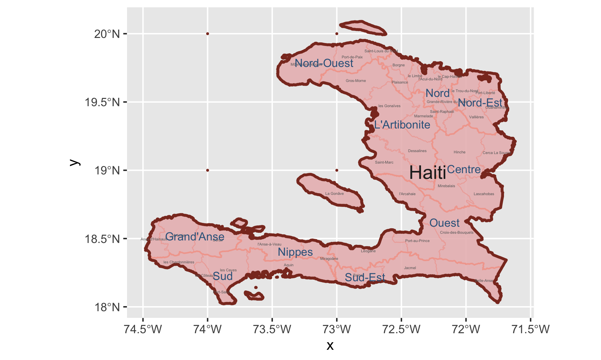

# Final Project: Analysis of Human Development in Haiti

## Political Subdivisions
Haiti has four administrative levels, ADM0(country), ADM1(department), ADM2(arrondissements), and ADM3(communal sections). This is a map of Haiti with administrative level 1 and 2 labeled. I made the color of the map red with blue labels of names of administrative subdivisions because the flag of Haiti is colored red and blue. The areas I'm going to focus on later are Port-au-Prince, Jacmel, and Bainet. They are subdivisions of Ouest and Sud-Est.

