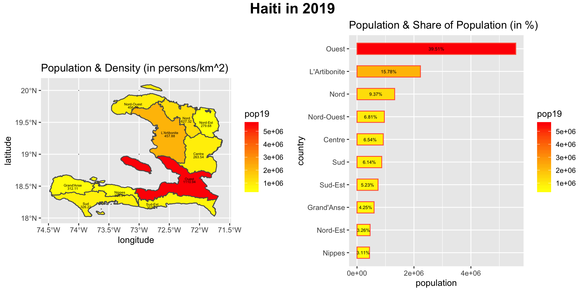
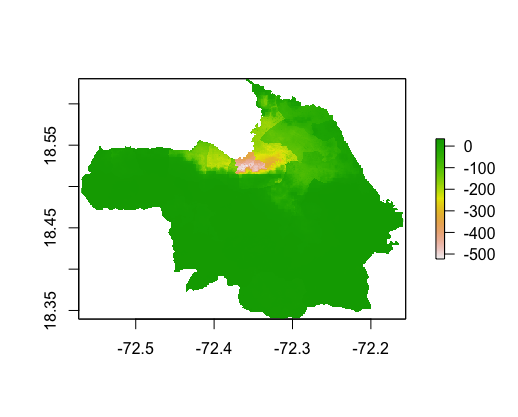

# Final Project: Analysis of Human Development in Haiti

## Political Subdivisions
Haiti has four administrative levels, ADM0(country), ADM1(department), ADM2(arrondissements), and ADM3(communal sections). This is a map of Haiti with administrative level 1 and 2 labeled. I made the color of the map red with blue labels of names of administrative subdivisions because the flag of Haiti is colored red and blue. The areas I'm going to focus on later are Port-au-Prince, Jacmel, and Bainet. They are subdivisions of Ouest and Sud-Est.

## Population
This graph shows the population, density, and population share of Haiti. The administrative subdivision, Ouest, with the largest population is where the capital of Haiti, Port-au-Prince, is located.

The image below is a combined plot that shows the histogram of the population log of Haiti ADM2 and the line plot of the population density.

.png)

The image below shows the regression model using water, dst011, dst040, dst130, dst140, dst150, dst160, dst190, dst200, topo, slope, and ntl as predictors. The model predicts the population accurately as it's R-squared value is 0.9342.

This plot shows the difference between the population predicted by the model and the actual population in 2015 for Port-au-Prince. The population of the reddish part is underpredicted.

Here is the population 3D plot for Port-au-Prince.

## Human Settlements, Roadways and Health Care Facilities
For this part, I focused on two adm2s, Jacmel and Bainet. The orange lines are the road networks. Since Haiti has a large number of unclassified road net works, the plot shows a lot of disconnected tracks. The red points represent hospitals and the yellow ones represent other health care facilities. The locations of these facilities are mostly consistent with the positions of urban areas.

Bainet and Jacmel are located on the southern part of the country. The largest urban area in these two ADM2s is Jacmel city. It has a population of about 80,000 and the population density of Jacmel city is more than 2,000. The whole area of Bainet and Jacmel has 60 hospitals and one-fifth of those hospitals are located in Jacmel city. Though the road network is not that perfect, almost all the hospitals have major road networks around them. The urban area is effected by the topography because the majority of these areas are mountains and Jacmel city is based on a rather flat topography. It is also next to the Caribbean sea.

