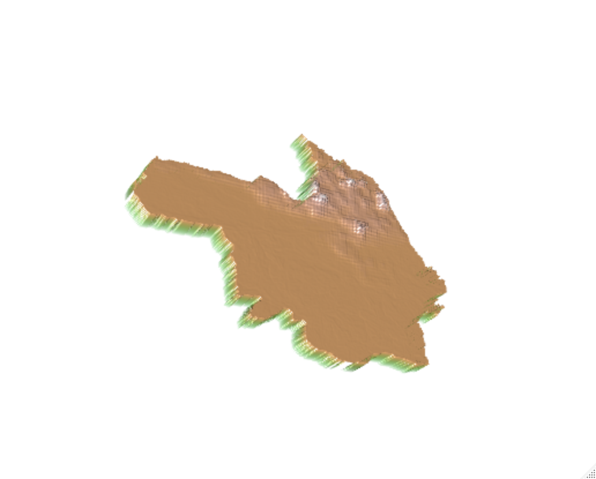
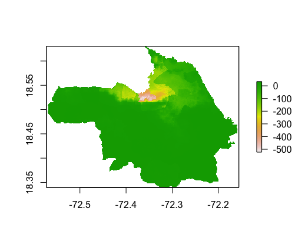
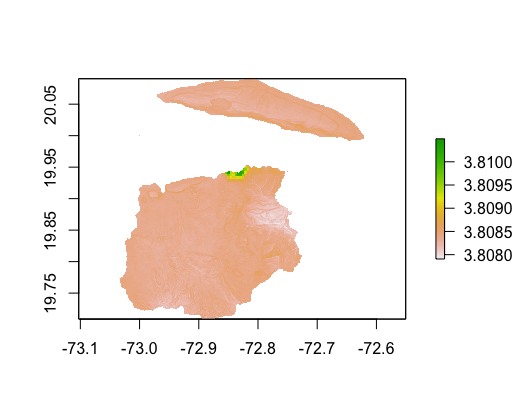
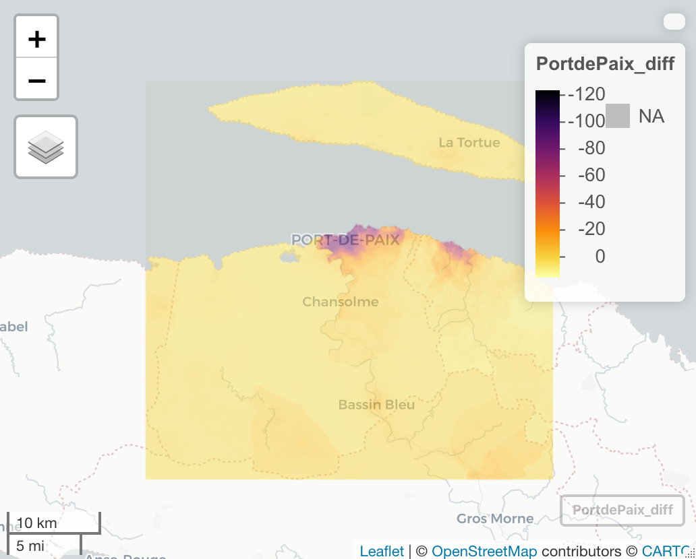

# Project 2: Haiti

## Part 1: Acquiring, Modifying, and Describing the Data

### Night Time Light combined with Density

### Population Log combined with Density
.png)
### Residuals for Model Using Variables of Night Time Lights, Urban Cover, and Bare Cover

R-squared:  0.9088 p-value: < 2.2e-16
### Residuals for Model Using All Variables

R-squared:  0.9342

## Part 2: Modeling & Predicting Spatial Values

### Population and Differences Maps of Haiti

This map above shows the population of Haiti in 2015.

This plot above shows the difference between the population predicted by the model and the actual population in 2015 for Haiti. The population of the reddish part is underpredicted.

### Population and Differences Maps of Port-au-Prince, Haiti

Here is the population 3D plot for Port-au-Prince, the capital city of Haiti.

This plot shows the difference between the population predicted by the model and the actual population in 2015 for Port-au-Prince. The population of the reddish part is underpredicted.

### Population and Differences Maps of Port-de-Paix, Haiti

This map shows the population of Port-de-Paix in 2015. Port-de-Paix is near the ocean and located in the north of Haiti.

Here is the mapview for Port-de-Paix. It shows us the difference between the population predicted by the model and the actual population in 2015 for Port-de-Paix. The darker area is where the city is located in and its population is underpredicted.

