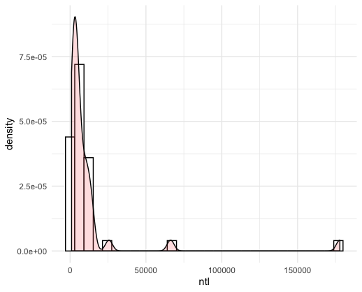
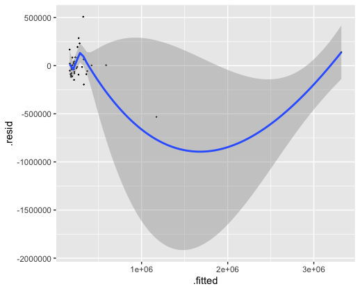
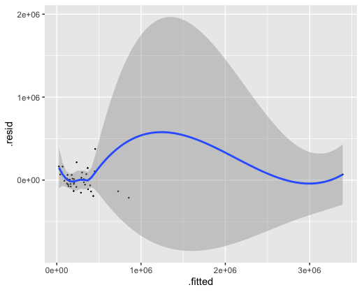
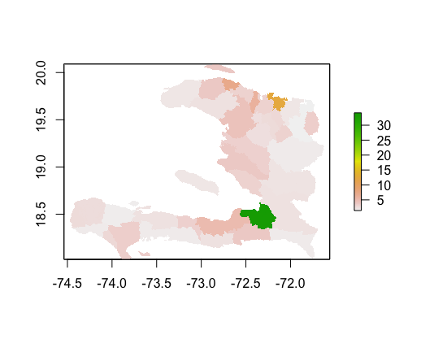
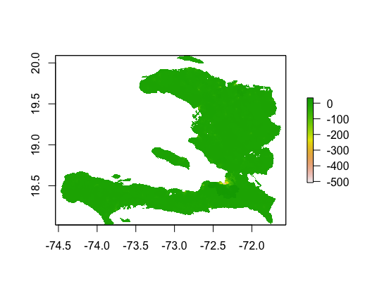

# Project 2: Haiti

## Part 1: Acquiring, Modifying, and Describing the Data

### Night Time Light combined with Density

### Population Log combined with Density
.png)
### Residuals for Model Using Variables of Night Time Lights, Urban Cover, and Bare Cover

R-squared:  0.9088 p-value: < 2.2e-16
### Residuals for Model Using All Variables

R-squared:  0.9342

## Part 2: Modeling & Predicting Spatial Values

### Population and Differences Maps of Haiti

This map shows the population of Haiti in 2015.

This plot shows the difference between the population predicted by the model and the actual population in 2015 for Haiti. The population of the reddish part is underestimated.

